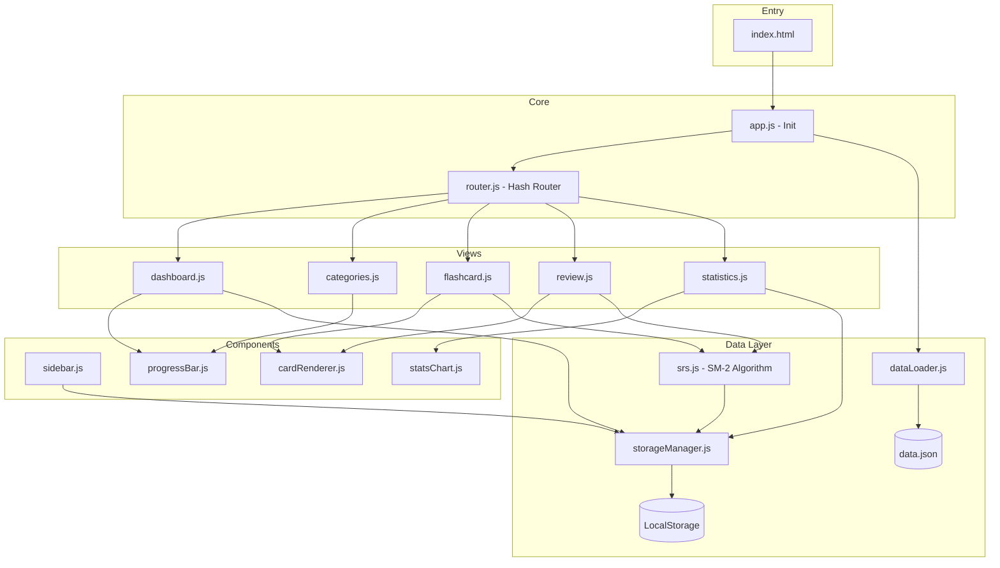
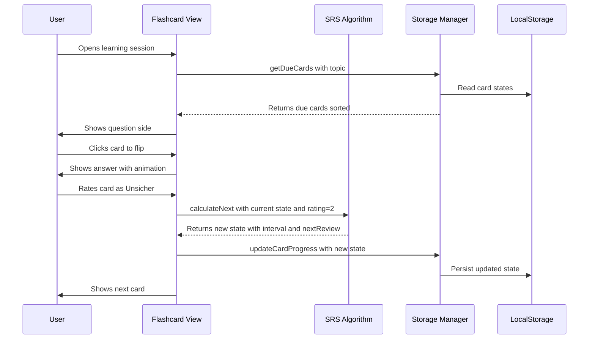

# AP1 Flashcard Learning App — Architecture Plan

## Overview

A modern, client-side Single-Page Application for IHK AP1 exam preparation. Built with **vanilla HTML, CSS, and JavaScript** — no build tools, no frameworks, no backend. Designed with a modular architecture that allows future expansion with new learning modes.

---

## Data Analysis

- **144 flashcards** across **11 main topics** and **~40 subtopics**
- Each card has: `id`, `topic`, `subtopic`, `type`, `difficulty` (1-3), `question`, `answer`, `tags`
- Topics range from "1. Grundlagen" to "11. IT-Sicherheit und Datenschutz"

---

## File Structure

```
AP1/
├── index.html                  # Single entry point
├── data.json                   # Flashcard data (existing)
├── plans/
│   └── architecture.md         # This file
├── css/
│   ├── variables.css           # CSS custom properties, colors, typography
│   ├── base.css                # Reset, global styles, utilities
│   ├── layout.css              # Sidebar, main content, responsive grid
│   ├── components.css          # Cards, buttons, badges, progress bars
│   ├── flashcard.css           # 3D flip animation, card styling
│   └── animations.css          # Transitions, keyframes, micro-interactions
├── js/
│   ├── app.js                  # App initialization, router setup
│   ├── router.js               # Hash-based SPA router
│   ├── data/
│   │   ├── dataLoader.js       # Fetch and parse data.json
│   │   ├── storageManager.js   # LocalStorage abstraction layer
│   │   └── srs.js              # Spaced Repetition System algorithm
│   ├── views/
│   │   ├── dashboard.js        # Home/Dashboard view
│   │   ├── categories.js       # Topic browser view
│   │   ├── flashcard.js        # Flashcard learning session view
│   │   ├── review.js           # Review mode (all due cards)
│   │   └── statistics.js       # Statistics and progress view
│   └── components/
│       ├── sidebar.js          # Sidebar navigation component
│       ├── progressBar.js      # Reusable progress bar
│       ├── cardRenderer.js     # Flashcard DOM rendering
│       └── statsChart.js       # Simple chart/visualization component
└── assets/
    └── icons/                  # SVG icons (inline or sprite)
```

---

## Architecture Diagram



---

## Module Specifications

### 1. Router — `js/router.js`

Hash-based SPA router. Maps URL fragments to view render functions.

- **Routes:**
  - `#/` → Dashboard
  - `#/categories` → Topic Browser
  - `#/learn/:topicId` → Flashcard session for a specific topic
  - `#/learn/:topicId/:subtopicId` → Flashcard session for a specific subtopic
  - `#/review` → Review all due cards
  - `#/statistics` → Statistics page
- **API:** `navigate(hash)`, `onRouteChange(callback)`, `getParams()`

### 2. Data Loader — `js/data/dataLoader.js`

Fetches `data.json` once, caches it in memory, provides query methods.

- `loadData()` → fetches and caches all cards
- `getAllCards()` → returns all 144 cards
- `getTopics()` → returns unique topic list with card counts
- `getSubtopics(topic)` → returns subtopics for a topic
- `getCardsByTopic(topic)` → filter by topic
- `getCardsBySubtopic(subtopic)` → filter by subtopic
- `getCardById(id)` → single card lookup

### 3. Storage Manager — `js/data/storageManager.js`

Abstraction over LocalStorage for persistence. All SRS data is stored under a single key as JSON.

**Stored Data Structure:**

```json
{
  "version": 1,
  "cards": {
    "1": {
      "easeFactor": 2.5,
      "interval": 1,
      "repetition": 0,
      "nextReview": "2026-02-08T00:00:00Z",
      "lastRating": null,
      "reviewCount": 0,
      "correctCount": 0,
      "incorrectCount": 0,
      "partialCount": 0
    }
  },
  "lastSession": "2026-02-07T10:00:00Z",
  "totalReviews": 0,
  "streakDays": 0,
  "streakLastDate": null
}
```

- `getCardProgress(cardId)` → returns SRS state for a card
- `updateCardProgress(cardId, rating)` → updates after review
- `getDueCards(topicFilter?)` → returns cards due for review
- `getStatistics()` → aggregated stats
- `resetProgress()` → clear all data
- `exportData()` / `importData()` → future-proofing

### 4. SRS Algorithm — `js/data/srs.js`

Implementation based on **SM-2 algorithm** with three rating levels mapped to SM-2 quality scores:

| User Rating | Label                | SM-2 Quality | Effect                                    |
| ----------- | -------------------- | ------------ | ----------------------------------------- |
| 1           | Nicht gewusst        | 0            | Reset to beginning, review very soon      |
| 2           | Unsicher / Teilweise | 3            | Moderate interval increase                |
| 3           | Gewusst              | 5            | Full interval increase, easy factor grows |

**Algorithm:**

```
if quality < 3:
    repetition = 0
    interval = 1
else:
    if repetition == 0: interval = 1
    elif repetition == 1: interval = 3
    else: interval = round(interval * easeFactor)
    repetition += 1

easeFactor = max(1.3, easeFactor + (0.1 - (5 - quality) * (0.08 + (5 - quality) * 0.02)))
nextReview = now + interval days
```

- `calculateNext(currentState, rating)` → returns new SRS state
- `isDue(cardState)` → checks if card is due for review
- `sortByPriority(cards)` → sorts due cards by urgency

### 5. Dashboard View — `js/views/dashboard.js`

The landing page showing:

- Welcome message with streak counter
- Overall progress bar - percentage of mastered cards
- Grid of topic cards, each showing:
  - Topic name and icon
  - Number of cards in topic
  - Progress bar - known/unsure/unknown ratio
  - Number of due cards
  - Click to enter learning mode
- Quick action: Start Review button showing total due cards count

### 6. Categories View — `js/views/categories.js`

Detailed topic browser:

- Expandable topic list with subtopics
- Card counts per subtopic
- Progress indicators
- Click subtopic to start focused learning session

### 7. Flashcard View — `js/views/flashcard.js`

Core learning experience:

- Card counter showing position in deck
- 3D flip card with question on front, answer on back
- Click/tap to flip with CSS 3D transform animation
- After flip, show three rating buttons:
  - 🔴 Nicht gewusst
  - 🟡 Unsicher
  - 🟢 Gewusst
- After rating, automatically advance to next card
- Progress bar for current session
- Option to end session early
- Session summary at the end

### 8. Review Mode — `js/views/review.js`

Cross-topic review of all due cards:

- Same flashcard UI as learning mode
- Cards sorted by SRS priority - overdue first
- Shows topic/subtopic badge on each card for context
- Filter option to select specific topics

### 9. Statistics View — `js/views/statistics.js`

Learning analytics dashboard:

- Overall mastery percentage
- Cards breakdown: mastered / unsure / not known / new
- Per-topic progress bars
- Review history - cards reviewed today/this week
- Learning streak
- Simple bar chart of daily review activity

### 10. Sidebar Component — `js/components/sidebar.js`

Persistent navigation:

- App logo/title
- Nav links: Dashboard, Categories, Review, Statistics
- Due cards badge on Review link
- Active state highlighting
- Collapsible on mobile - hamburger menu

---

## UI/UX Design Specifications

### Color Scheme - Dark Theme with Accent Colors

```css
--bg-primary: #0f172a; /* Deep navy background */
--bg-secondary: #1e293b; /* Card/sidebar background */
--bg-tertiary: #334155; /* Hover states */
--text-primary: #f1f5f9; /* Main text */
--text-secondary: #94a3b8; /* Secondary text */
--accent-primary: #6366f1; /* Indigo - primary actions */
--accent-secondary: #8b5cf6; /* Purple - secondary */
--success: #22c55e; /* Green - Gewusst */
--warning: #eab308; /* Yellow - Unsicher */
--danger: #ef4444; /* Red - Nicht gewusst */
--card-bg: #1e293b; /* Flashcard background */
--border: #334155; /* Subtle borders */
```

### Typography

- **Headings:** Inter or system font stack, bold, tracking tight
- **Body:** 16px base, 1.6 line height
- **Code/Terms:** Monospace for technical terms where appropriate

### Animations

- **Card flip:** `transform: rotateY(180deg)` with `perspective(1000px)`, 0.6s ease
- **Page transitions:** Subtle fade-in, 0.3s
- **Button hover:** Scale 1.02, shadow increase
- **Progress bars:** Animated width transitions
- **Rating buttons:** Slide up after card flip

### Responsive Breakpoints

- **Desktop:** >= 1024px — Sidebar visible, wide card layout
- **Tablet:** 768px-1023px — Collapsible sidebar, adjusted grid
- **Mobile:** < 768px — Full-width, bottom nav or hamburger, stacked layout

---

## Flashcard Flip Animation Detail

```
┌─────────────────────┐
│                       │
│    Question Side      │    ← Click/Tap to flip
│    - Question text    │
│    - Topic badge      │
│    - Difficulty dots  │
│                       │
└─────────────────────┘
         │
    3D Flip Animation
    rotateY 0° → 180°
         │
         ▼
┌─────────────────────┐
│                       │
│    Answer Side        │    ← Rating buttons appear
│    - Answer text      │
│    - Formatted lists  │
│                       │
├─────────────────────┤
│  🔴 Nicht  🟡 Unsicher  🟢 Gewusst  │
└─────────────────────┘
```

CSS approach:

```css
.flashcard {
  perspective: 1000px;
}
.flashcard-inner {
  transition: transform 0.6s ease;
  transform-style: preserve-3d;
}
.flashcard.flipped .flashcard-inner {
  transform: rotateY(180deg);
}
.flashcard-front,
.flashcard-back {
  backface-visibility: hidden;
}
.flashcard-back {
  transform: rotateY(180deg);
}
```

---

## Data Flow



---

## Modularity and Future Extensions

The architecture is designed so new features plug in as:

1. **New View Module** in `js/views/` — registered with the router
2. **New Component** in `js/components/` — reusable UI building blocks
3. **New Sidebar Entry** — add a nav link

**Planned future modules that this architecture supports:**

- Pseudocode Simulator → `js/views/pseudocode.js`
- Network Planning Exercises → `js/views/netzplan.js`
- Interactive Exercise Boards → `js/views/exercises.js`
- Quiz Mode with multiple choice → `js/views/quiz.js`
- Exam Simulation Timer → `js/views/exam.js`

Each would be a self-contained view with its own logic, using shared components and the data layer.

---

## Implementation Order

1. **Project scaffolding** — Create all files with basic structure
2. **Data layer** — `dataLoader.js`, `storageManager.js`, `srs.js`
3. **Router and app shell** — `router.js`, `app.js`, sidebar, layout CSS
4. **Dashboard** — Topic overview with progress
5. **Flashcard view** — Core learning experience with 3D flip and rating
6. **Review mode** — Cross-topic due card review
7. **Statistics** — Progress visualization
8. **Polish** — Responsive design, animations, micro-interactions, edge cases
